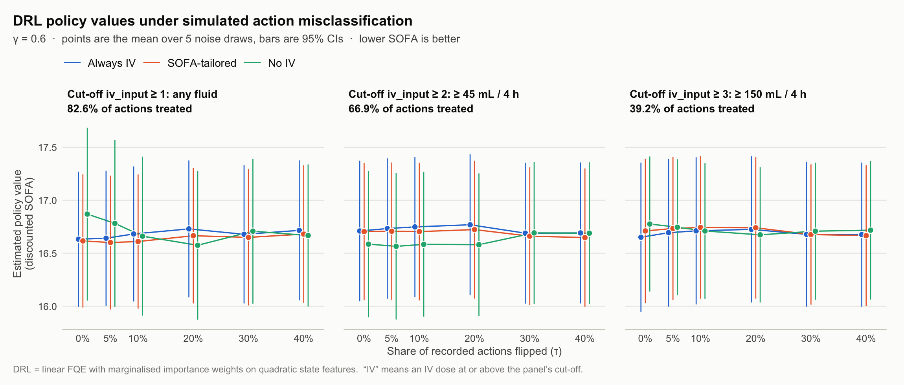

# MIMIC-III sepsis analysis — status for co-author review

This folder holds the real-data application (Section 6, Table 1) of *Off-Policy
Evaluation with Hidden Actions* (arXiv:2607.25241), plus the follow-up analyses run
after a code review in September 2026. **Please check the reasoning, the numbers, and
the questions in [§10](#10-questions-for-review).**

## Summary

- **The goal of the current work:** show that the DRL baseline's value estimate
  changes materially as the rate of action misclassification grows, while LURE's
  estimate is designed to be robust to it.
- **Status: on the real MIMIC data, DRL does not change materially.** Across three
  action cut-offs, five DRL designs and misclassification rates up to 40%, the largest
  average shift is 0.29, about a third of a CI half-width (§5).
- **Why:** once the state is accounted for, the recorded IV action has no association
  with next-step SOFA at any cut-off. Misclassification can only distort an effect
  that exists, so no estimator that treats the recorded action as the true action will
  move much on this data (§5.3).
- **Proposed route:** a semi-synthetic experiment on the MIMIC states with a
  *known* planted action effect, where the attenuation can be demonstrated and
  measured (§7).
- **Proposed covariate reduction:** from 45 state variables to 28 or 14. This removes
  near-duplicates, derived and composite variables, rarely re-measured labs and a
  cumulative total, while keeping predictive fit and confounding control (§8). It is
  worth doing on its own merits and bears on LURE's latent-class problem, but on its
  own it does not make DRL sensitive to misclassification (checked for DRL, §8).
- **Proposed sample-size study:** the analysis uses N = 500, the first 500 stay IDs of
  3,708 eligible stays. We suggest also trying N = 1,000, 2,000 and all 3,708, with
  random subsamples (§9).
- **Two findings that affect the paper as submitted:**
  1. In the submitted analysis the reward was an exact copy of a state variable,
     which made LURE's correction term vanish. This has been fixed, and it changes
     Table 1 (§3).
  2. On this data, LURE's latent "action" tracks whether a new lab panel was drawn,
     not IV fluids (§6).

---

## 1. Folder contents

| File | Role |
|---|---|
| `MIMIC.R` | Definitions only (data pipeline, feature map, policies, LURE, DRL). Safe to `source()`. |
| `run_mimic.R` | Main analysis (γ = 0.9, 2-fold cross-fit) → `res.RData`. |
| `res.RData` | Current main-analysis workspace. **Every study script reads its `dat` from here.** |
| `res_published_currentSOFA.RData` | Original workspace behind the submitted Table 1. |
| `sepsis_processed_state_action.csv` | Preprocessed MIMIC-III panel. **Credentialed data, see §12.** |
| `figures/` | `drl_noise_cutoffs_gamma06.png` and its table view (`.csv`). |
| **DRL under misclassification** | |
| `study_drl_noise_cutoffs.R` → `drl_noise_cutoffs.rds` | **Main result** (§5.1): γ = 0.6, cut-offs 1–3, produces the figure. With `COVARIATES=reduced` it uses the 28-variable state (→ `drl_noise_cutoffs_reduced.rds`, `figures/…_reduced.*`; §8). |
| `study_drl_noise_designs.R` → `drl_noise_designs.rds` | Five DRL designs under misclassification (§5.2). |
| `study_drl_features.R` → `drl_features.rds` | Why matched-feature DRL equals FQE; designs that don't (§4). |
| `study_drl_insensitivity.R` | Why DRL doesn't move (§5.3). Reads the two `.rds` files below. |
| `study_drl_action_noise.R` → `drl_action_noise.rds` | Earlier DRL noise study, γ ∈ {0.4, 0.5, 0.7, 0.9}. |
| `study_drl_gamma.R` → `drl_gamma_sweep.rds` | DRL across γ, compared with LURE. |
| `study_action_cutoffs.R` | What each dose code means; action effect by cut-off (§2, §5.3). |
| `study_covariates.R` | Evidence for the proposed covariate reduction (§8). |
| `study_cohort.R` | How the first 500 stays compare with all 3,708 and with random 500-stay samples (§9). |
| **LURE** | |
| `study_lure_gamma.R` → `lure_gamma_sweep.rds` | LURE without cross-fitting across γ. Writes a 1.6 GB EM cache. |
| `study_lure_action_noise.R` → `lure_action_noise.rds` | LURE under the same misclassification draws as DRL (§6). |
| `study_lure_latent_class.R` | What LURE's latent class actually is (§6). |

Superseded and exploratory files were moved, not deleted, to
`../MIMIC_archive_20260922/` (see its `ARCHIVE_NOTE.md`).

## 2. Setup

| | |
|---|---|
| Cohort | ICU stays with exactly 20 four-hour blocs. **The analysis uses the first 500 stay IDs of 3,708 eligible stays, not a random sample** (see §9). |
| Transitions | T = 19 per stay (bloc t → t+1), so 9,500 in total. |
| State | 46 curated variables. `re_admission` is identically 0 in this cohort and is dropped, so **d = 45**. |
| Reward | **SOFA at t+1**; lower is better. |
| Action | A = 1{`iv_input` ≥ k}. The submitted analysis uses k = 1. |
| Target policies | Always IV (π = 1), No IV (π = 0), SOFA-tailored (IV iff SOFA ≥ 3). In code, `sofa_11` means SOFA ≥ 3. |

`iv_input` is a dose code binned from `input_4hourly` (from `study_action_cutoffs.R`):

| code | share | volume per 4 h (min – median – max) | clinically |
|---:|---:|---|---|
| 0 | 17.4% | 0 | none |
| 1 | 15.7% | 0.5 – 25 – 45 mL | carrier / line-flush volume |
| 2 | 27.7% | 45 – 80 – 148 mL | below a maintenance rate |
| 3 | 22.3% | 149 – 253 – 480 mL | maintenance-range fluid |
| 4 | 16.9% | 482 – 800 – 9,375 mL | bolus / resuscitation |

With k = 1, "IV" includes 25 mL of drug diluent over four hours, so 82.6% of
transitions count as treated.

## 3. Changes to the code since submission, and their effect on Table 1

| Change | Why |
|---|---|
| **Reward = SOFA at t+1** (was SOFA at t) | SOFA at t was also a state variable, so the reward was an exact copy of a state coordinate. The EM's reward model then fit perfectly for both latent classes, and LURE's correction term became zero (it stayed nonzero only where reward clipping bound, 7% of transitions). The submitted LURE numbers were therefore plug-in FQE estimates. The old behaviour is still available as `reward_timing = "current"`. |
| Drop constant state columns | `re_admission ≡ 0` made the linear design exactly rank-deficient. |
| `MIMIC.R` is definitions only; analysis moved to `run_mimic.R` | It previously ran the analysis and `save.image()` on `source()`. |
| New `cross_fit` option (default `TRUE`) | `FALSE` fits nuisances once on all data. It removes the single random split, which alone moved the No-IV estimate by about 15 points. |

Table 1 at γ = 0.9 with 2-fold cross-fitting:

| Policy | Submitted: DRL | Submitted: LURE | Now: DRL | Now: LURE |
|---|---|---|---|---|
| Always IV | 66.29 [63.78, 68.79] | 62.10 [60.16, 64.04] | 66.50 [63.92, 69.08] | 57.16 [31.95, 82.38] |
| No IV | 67.15 [62.42, 71.88] | 68.63 [67.03, 70.22] | 67.46 [62.32, 72.60] | 60.02 [38.22, 81.83] |
| SOFA-tailored | 66.91 [64.27, 69.55] | 65.92 [64.30, 67.53] | 67.19 [64.46, 69.92] | 60.46 [39.43, 81.48] |

Now that the correction term is active, LURE's intervals at γ = 0.9 are very wide.
Most of that variance comes from its γ/(1−γ) = 9 multiplier. Lowering γ shrinks it
sharply: at γ = 0.6 without cross-fitting, LURE gives 14.94 [13.17, 16.70],
16.82 [15.12, 18.52] and 15.89 [14.27, 17.51], and DRL gives 16.68 [16.05, 17.31],
16.76 [15.96, 17.57] and 16.77 [16.14, 17.41] (Always IV, No IV, SOFA-tailored). γ is
part of the estimand, though, so it needs a clinical justification (§10).

## 4. Which DRL — the baseline in the paper equals FQE

The production DRL (`mimic_drl_estimate`) is FQE plus a marginalised-importance-weight
(MIS) correction. Both nuisances use the same linear features, and at FQE's fixed point
that makes the correction **exactly zero**. The TD residual is orthogonal to FQE's
features by the normal equations, and ω is a linear combination of those same
features. So the baseline in the paper is FQE.

Two consequences:
- At γ = 0.9, production FQE runs only 20 iterations, which leaves 0.9²⁰ = 12% of the
  value unconverged. The submitted DRL "correction" of 7.83 was compensating for that,
  not correcting bias. On the submitted data, iterating FQE to convergence drives the
  correction 7.83 → 0.32 → 0.002 → 0 (20, 50, 100, 200 iterations) while the DRL
  total stays at 66.29. The same happens under the current reward (7.82 → 0, total
  66.50; `study_drl_insensitivity.R`, check 5).
- The cancellation breaks when FQE is regularised, when FQE has fewer features than ω,
  or when ω has more features than FQE. Adding a ridge to ω alone does **not** break it
  (`study_drl_features.R`). The main figure uses **linear FQE + quadratic-feature ω**,
  a genuinely doubly robust design.

## 5. DRL under action misclassification — the main result

**Design:** γ = 0.6. Each recorded action is flipped independently with probability
τ ∈ {0, 5, 10, 20, 30, 40%}, with 5 noise draws per τ (seed `20260921 + draw`). The
same draws are reused across every cut-off, design and estimator, so all comparisons
are paired. FQE is iterated to convergence.

### 5.1 Across action cut-offs (`study_drl_noise_cutoffs.R`)

The full value and CI table is in `figures/drl_noise_cutoffs_gamma06.csv`. Largest
average change from τ = 0:

| Cut-off | Policy | V at τ = 0 | V after change | at τ | change | vs CI half-width |
|---|---|---:|---:|---:|---:|---:|
| ≥ 1 | No IV | 16.87 | 16.57 | 20% | −0.29 | 36% |
| ≥ 2 | No IV | 16.59 | 16.69 | 30% | +0.11 | 15% |
| ≥ 3 | No IV | 16.78 | 16.67 | 20% | −0.10 | 16% |
| any | Always IV / SOFA | | | | ≤ 0.10 | ≤ 15% |

The largest change is at cut-off ≥ 1 for No IV. That is where the untreated arm is
smallest (17% of transitions), so relabelling reshuffles it the most. One noise draw
gives 16.87 → 16.23. The change is not monotone in τ, though: by 40% the average is
back to 16.67. That pattern reflects instability from refitting a small arm, not an
attenuation that grows with τ.

### 5.2 Across DRL designs (`study_drl_noise_designs.R`, cut-off ≥ 1)

Largest average shift over τ, in units of the τ = 0 standard error:

| Design | Always IV | SOFA | No IV |
|---|---:|---:|---:|
| DRL = FQE (reference) | 0.29 | 0.17 | 0.58 |
| FQE ridge 1000 | 0.28 | 0.17 | 0.50 |
| FQE ridge 10000 | 0.25 | 0.14 | 0.35 |
| ω quadratic | 0.30 | 0.20 | 0.71 |
| FQE SOFA-only | 0.28 | 0.15 | 0.48 |

### 5.3 Why DRL doesn't move

1. **There is no conditional action effect to distort.** Next-step SOFA regressed on
   the 45 state variables plus A (`study_action_cutoffs.R`):

   | Cut-off | P(A = 1) | adjusted effect of A (t) | raw difference |
   |---|---:|---:|---:|
   | ≥ 1 | 82.6% | −0.015 (−0.29) | +0.60 |
   | ≥ 2 | 66.9% | +0.025 (0.60) | +0.61 |
   | ≥ 3 | 39.2% | +0.037 (0.92) | +0.64 |
   | ≥ 4 | 16.9% | +0.051 (0.99) | +1.12 |

   The raw gap is confounding by indication: sicker patients get more fluid. The state
   absorbs all of it. A dose-response fit comparing each level with none also shows
   nothing (|t| < 0.83).
2. **Relabelling only moves transitions between two regressions that estimate the
   same function.** After 40% flips, the fitted Q-functions shift by less than 0.1 on
   average, against sd(Q) ≈ 5.4 (γ = 0.5, `study_drl_insensitivity.R`, check 3).
3. **In DR designs, the pieces move but offset.** For example, with FQE ridge 10000,
   No IV at τ = 40%: the direct term moves +0.83, the correction −0.93, and the total
   −0.10. That is double robustness working as intended.

## 6. What we learned about LURE on this data

From `study_lure_latent_class.R`, on the full-sample EM:

- The EM's E-step is driven almost entirely by the 45-dimensional next state. Mean
  |log-likelihood ratio| is 5,485 for the next state, 0.45 for the reward and **0.096
  for the recorded action**.
- Within the next state, lab values dominate (SGPT, SGOT, platelets, BUN, bilirubin).
  Labs are carried forward between draws: SGPT and SGOT are unchanged from t to t+1
  in 78% of transitions, against 1–9% for vitals. A carried-forward value has zero
  residual, so one latent class gets a near-zero variance and the EM splits
  transitions by **"labs carried forward" vs "new lab draw."**
- The latent class agrees with lab carry-forward **84.1%** of the time and with the
  recorded action **60.8%** (chance: 59.4%). P(A~ = 1 | latent) is 0.815 vs 0.831, a
  gap of only 0.016.

Under the misclassification study (`study_lure_action_noise.R`), the latent classes
stay the same through 30% flips, because they don't depend on the action. At 40% the
IV/no-IV *labels* swap in 3 of 5 draws. The label is assigned from that 0.016 gap, so in
exactly those three draws every policy contrast reverses sign, with |z| up to 5.0
(γ = 0.5). The other two draws keep the τ = 0 ordering.

**Implication:** the policy contrast LURE reports on MIMIC is mostly a contrast between
lab-measurement regimes, not an IV-fluid effect. Possible remedies: restrict the EM's
next-state likelihood to frequently measured, fluid-responsive variables (MAP, HR,
Shock_Index, urine output); model lab carry-forward explicitly; or constrain the
measurement model so μ₁ − μ₀ reflects a plausible misclassification rate. None of
these has been tried yet. §8 gives a concrete variable list.

## 7. Proposed next step: a semi-synthetic experiment

To demonstrate DRL's sensitivity to misclassification credibly, the true effect has
to be known and nonzero. Proposal:

1. Keep the real MIMIC states and transitions. Treat the recorded action A (at a
   chosen cut-off) as the true action.
2. Plant a known effect in the reward, R′ = SOFA at t+1 − β·A. Since the real
   conditional effect is about zero, the true Always-IV − No-IV contrast is about
   −β/(1−γ), which is −2.5β at γ = 0.6.
3. Misclassify A at rate τ, then run DRL and LURE on (S, Ã, R′, S′).
4. DRL should attenuate toward zero: roughly by (1−2τ) with balanced arms, and more
   with imbalanced arms such as cut-off ≥ 1. The planted β is the benchmark.

This gives the result we want to show, and it is honest about being semi-synthetic.
It also tests LURE directly. Given §6, LURE may not recover β unless its next-state
channel is fixed first.

## 8. Proposed covariate reduction

The state has 45 covariates, so each linear nuisance fits 46 coefficients per action
arm, and the EM refits 90 next-state regressions on every iteration. Many of those
covariates add little on their own (`study_covariates.R`):

| Problem | Variables to drop | Evidence |
|---|---|---|
| Near-duplicates | PT, CO2_mEqL, SGOT, paO2, DiaBP | correlated with INR (r = 0.95), base excess (0.92), SGPT (0.92), P/F ratio (0.88), MAP (0.85) |
| Derived from kept variables | SysBP, FiO2_1 | shock index = HR/SBP and P/F ratio = PaO₂/FiO₂; shock index, HR and SBP have VIFs of 29.5, 17.0 and 14.7 |
| Composite score | SIRS | built from HR, RR, temperature and WBC, all in the state |
| Acid–base redundancy | Arterial_BE, paCO2 | VIFs 19.7 and 10.3 alongside pH and HCO₃ |
| Rarely re-measured, low priority for fluid response | SGPT, Albumin, Magnesium, Calcium, Ionised_Ca, PTT, Chloride | unchanged between blocs in 54–81% of transitions |
| Cumulative, grows with time | output_total | replaced by per-bloc urine output, `output_4hourly` |

Two candidate sets:

- **Reduced (d = 28):** drops the 18 variables above and adds `output_4hourly`. It
  keeps SOFA; the vitals (MeanBP, HR, Shock_Index, RR, SpO2, Temp_C, GCS);
  oxygenation and ventilation (PaO2_FiO2, mechvent); thirteen labs (Arterial_lactate,
  Arterial_pH, HCO3, BUN, Creatinine, Glucose, Hb, INR, Platelets_count, Potassium,
  Sodium, Total_bili, WBC_count); `output_4hourly`; and the baseline covariates (age,
  gender, Weight_kg, elixhauser).
- **Compact (d = 14):** SOFA, MeanBP, HR, Shock_Index, RR, SpO2, Temp_C, PaO2_FiO2,
  mechvent, Arterial_lactate, `output_4hourly`, age, gender, elixhauser. The idea is that
  SOFA already summarises the organ labs (creatinine, bilirubin, platelets, P/F ratio,
  MAP, GCS), the vitals are measured every bloc and respond to fluid, and lactate is
  the key sepsis lab.

| Set | d | max VIF | R² for next-step SOFA | adjusted action effect, k ≥ 1 (t) | k ≥ 3 (t) |
|---|---:|---:|---:|---:|---:|
| full | 45 | 29.5 | 0.752 | −0.015 (−0.29) | +0.037 (0.92) |
| reduced | 28 | 5.6 | 0.750 | −0.009 (−0.18) | +0.053 (1.34) |
| compact | 14 | 5.3 | 0.747 | +0.005 (0.10) | +0.051 (1.31) |

The raw, unadjusted differences are +0.60 (k ≥ 1) and +0.64 (k ≥ 3).

What the table shows:
- **Little is lost.** R² falls by 0.003 (reduced) or 0.006 (compact), and the
  largest VIF drops from 29.5 to about 5.5.
- **Confounding control is kept.** The state-adjusted action effect stays near zero
  at both cut-offs, far from the raw differences. At k ≥ 3 it rises slightly (t from
  0.92 to about 1.3) but remains non-significant.
- **For the DRL goal:** because the adjusted action effect is still about zero, a
  smaller set will not by itself make DRL sensitive to misclassification. Fix the set
  on clinical and statistical grounds *before* re-running. Choosing covariates by
  whether they make DRL move would bring confounding back in the guise of an action
  effect.

**For LURE specifically:** static covariates (age, gender, elixhauser, unchanged in
100% of transitions; mechvent 97%) and rarely re-measured labs should stay out of the
EM's next-state likelihood, even if they stay in the conditioning set. That
likelihood should use variables that change from bloc to bloc, such as MeanBP, HR,
Shock_Index, RR, SpO2, `output_4hourly` and SOFA. This needs a MIMIC-specific change
to how `em_gym` builds the next-state likelihood. It is not implemented yet.

The sets are defined once, in `mimic_covariate_set()` in `MIMIC.R`.

**DRL on the reduced set** (`COVARIATES=reduced Rscript study_drl_noise_cutoffs.R`;
figure `figures/drl_noise_cutoffs_gamma06_reduced.png`, table view
`figures/drl_noise_cutoffs_gamma06_reduced.csv`). The reduced data is rebuilt
from the CSV through the production pipeline, and the script checks it against the
full data: same stays, rewards and actions, and identical values for the 27 shared
variables. The result is no more sensitive than with 45 covariates:

| | full (45) | reduced (28) |
|---|---:|---:|
| largest average change from τ = 0 | 0.29 (cut-off ≥ 1, No IV) | 0.24 (cut-off ≥ 2, No IV) |
| … as a share of the CI half-width | 36% | 36% |
| largest single-draw change | 0.64 | 0.46 |
| mean CI half-width | 0.68 | 0.66 |

At cut-off ≥ 2 the average No IV − Always IV gap shrinks from −0.34 at τ = 0 to −0.01
at τ = 40%. That is the shape attenuation would produce, but it does not hold up as
evidence of sensitivity: the starting gap is not distinguishable from zero (paired
95% CI [−0.87, +0.19]), the one-step adjusted action effect is still null (+0.033,
SE 0.042), and the five noise draws disagree (at 40% the gap ranges from −0.37 to
+0.14). It is also one of six cut-off × covariate-set panels, so one such pattern is
not surprising.

**LURE on the reduced set: not yet run.** To try it, pass
`state_cols = mimic_covariate_set("reduced")` to the `run_mimic_lure()` calls in
`run_mimic.R` and regenerate `res.RData`, which the study scripts read.

## 9. Sample size N

The analysis uses N = 500 stays: the **first 500 stay IDs** of the 3,708 eligible, so
the size of the sample and which patients are in it are currently tied together. The
first 500 IDs span 30–14,425, while the eligible IDs run up to 99,992. Compared with
1,000 random 500-stay samples (`study_cohort.R`), they fall inside the random range
on every summary checked, but near its edge on three:

| | first 500 | all 3,708 | random 500s, 95% range | percentile of first 500 |
|---|---:|---:|---|---:|
| mean SOFA per bloc | 6.77 | 6.56 | 6.32 – 6.79 | 96% |
| age (years) | 61.9 | 63.1 | 61.8 – 64.4 | 4% |
| blocs with IV ≥ 150 mL / 4 h | 38.8% | 37.0% | 34.4 – 39.5% | 92% |
| 90-day mortality | 30.6% | 29.2% | 25.2 – 33.0% | 74% |
| blocs with any IV | 82.3% | 82.1% | 79.6 – 84.2% | 55% |

So the current cohort is somewhat sicker and younger than a typical random draw,
though not implausibly so.

**Suggested study:**
- Try N ∈ {500, 1,000, 2,000, 3,708}. For each N below 3,708, draw several random
  subsamples (e.g. 5) with recorded seeds, so the effect of N is separated from the
  effect of which patients are drawn.
- Fix the N for the main analysis before looking at results, and report the others as
  a sensitivity analysis.

**What to expect** (estimates, assuming the standard error scales as 1/√N):

| N | 500 | 1,000 | 2,000 | 3,708 |
|---|---:|---:|---:|---:|
| standard error relative to N = 500 | 1.00 | 0.71 | 0.50 | 0.37 |
| DRL CI half-width at γ = 0.6 (now ≈ 0.68) | 0.68 | 0.48 | 0.34 | 0.25 |
| SE of the one-step action effect (now 0.052) | 0.052 | 0.037 | 0.026 | 0.019 |

- **For the DRL goal:** a larger N narrows the intervals, so a given shift becomes a
  larger share of the CI, and it gives more power to detect a real action effect if
  there is one. It will not create one. With the current estimate of the effect
  (−0.015), a larger N would most likely confirm that it is about zero rather than make
  DRL move. The semi-synthetic experiment (§7) would also benefit from a larger N. As
  with the covariates, the N should not be chosen by whether it makes DRL move.
- **Cost:** DRL is cheap at any N. LURE is not: the full-sample EM takes about 4 minutes
  and about 0.9 GB of memory at N = 500, mostly the 90 stored next-state `lm` fits.
  Scaling roughly linearly, one fit at N = 3,708 would need on the order of 6–7 GB and
  half an hour, and the parallel LURE noise study would not fit in 16 GB. Storing only
  the coefficients of those fits in `em_gym` would remove most of the memory cost.
- **Not implemented yet:** `run_mimic_lure(max_stays = N)` always keeps the first N
  IDs. Random subsamples need a small change (for example, an argument taking the stay
  IDs to keep), and the study scripts, which take their data from `res.RData` or the
  first-N rule, need the same option.

## 10. Questions for review

1. **Reward:** is SOFA at t+1 the right reward? (SOFA at t is degenerate, §3.)
2. **Action cut-off:** k = 1 counts carrier volumes as "IV." Would k = 3
   (≥ 150 mL per 4 h, arms 39/61%) or k = 4 (bolus-level) be more defensible? This
   needs deciding on clinical grounds, before looking at results.
3. **γ:** is 0.6 (an effective horizon of about 2.5 blocs, or 10 hours) clinically
   defensible, or should we stay at 0.9 and accept the width?
4. **Cohort and N (§9):** which N should the main analysis use, and should the stays
   be a random sample with a recorded seed rather than the first N IDs?
5. **Semi-synthetic (§7):** acceptable for the paper? What range of β?
6. **LURE on MIMIC (§6):** which remedy should we try first, and how should the
   real-data section be framed until it's fixed?
7. **DRL baseline:** report the genuine DR design (linear FQE + quadratic ω) and note
   that matched-feature DRL equals FQE?
8. **Covariates (§8):** adopt the reduced (28) or compact (14) set? Is any clinically
   essential variable missing from the compact set, or anything in it that shouldn't be?

## 11. Other known issues (not yet addressed)

- `mimic_solve_omega` and `mimic_naive_mis` apply a scalar ridge to *unstandardised*
  features (sd from 0.06 to 6,553). The study scripts standardise; production does not.
- Cross-fitting leaks: ω's initial-state term and the proxy selection use all
  trajectories. There is also only one 2-fold split.
- Production FQE runs 20 iterations (12% unconverged at γ = 0.9). LURE's weighted FQE
  runs 40 (1.5%).
- Dead code: `eta_te` in `mimic_mr_components`, `mimic_clip_prob`, `mimic_state_df`.
- The proxy variable (`Shock_Index`) has a partial correlation with the action of only
  0.044, and under small perturbations the selection switches between variables.

## 12. Reproducing, and data use

**Order and approximate runtimes:**
1. `run_mimic.R` (~15 min)
2. `study_lure_gamma.R` (~5 min, writes `lure_em_full.rds`, 1.6 GB)
3. `study_lure_action_noise.R` (~35 min on 4 workers; needs the files from step 2)
4. Everything else: independent, seconds to a few minutes each.
   `study_drl_insensitivity.R` needs `drl_gamma_sweep.rds` and `drl_action_noise.rds`.

`Rscript run_mimic.R out.RData current` reproduces the submitted Table 1 (verified: LURE
to within 10⁻¹³, DRL exactly; dropping the all-zero `re_admission` column changes
nothing).

**Environment:** R ≥ 4.5 with `dplyr` and `ggplot2`. `readr` is optional. Set
`OPENBLAS_NUM_THREADS=1 OMP_NUM_THREADS=1 VECLIB_MAXIMUM_THREADS=1` when running the
parallel scripts. Worker counts are set by `LURE_WORKERS` and `DRL_WORKERS`.

**Stale outputs:** `../simulation_results/mimic_action_noise_20260921*` predate the
reward and state fixes. Don't cite them.

**Data use:** `sepsis_processed_state_action.csv` is derived from MIMIC-III and
covered by the PhysioNet data use agreement. So are `res.RData` and
`res_published_currentSOFA.RData`, which contain the patient-level state arrays, and
several `.rds` files hold per-patient estimates. Removing the CSV alone does not make
the folder shareable. Share it only with credentialed collaborators, and don't commit
these files; `Code/.gitignore` does not currently exclude them.
